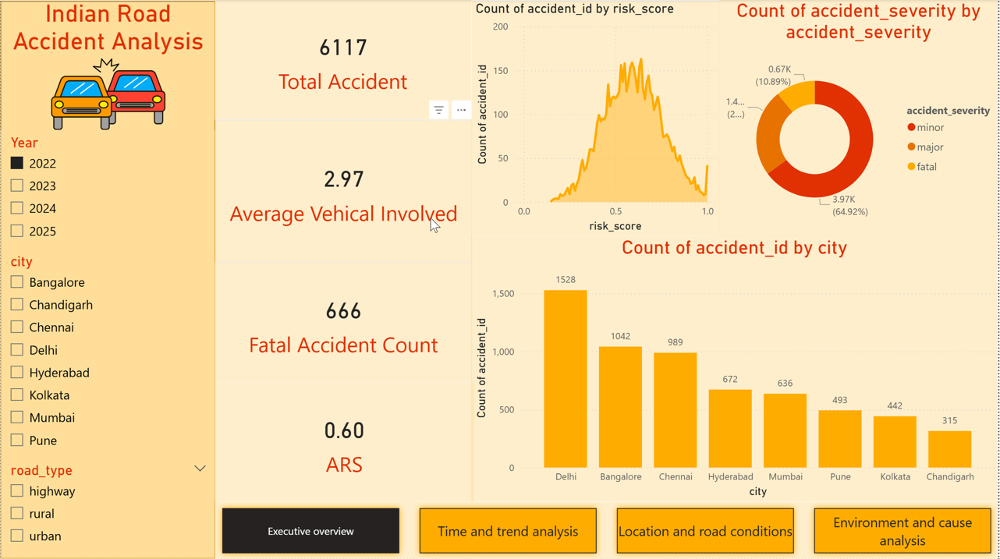
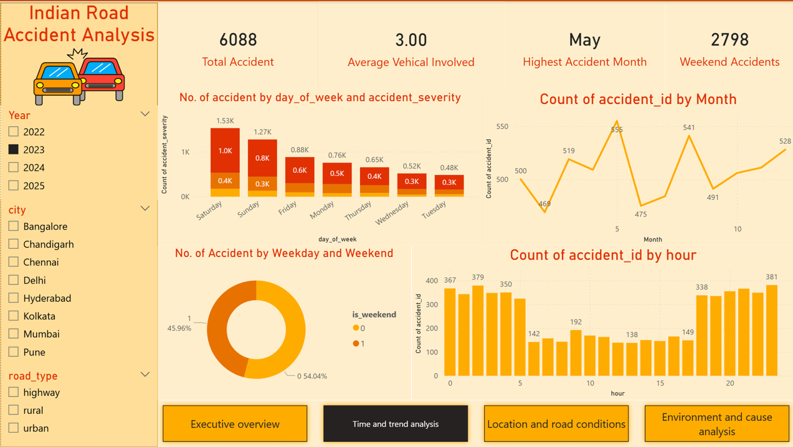
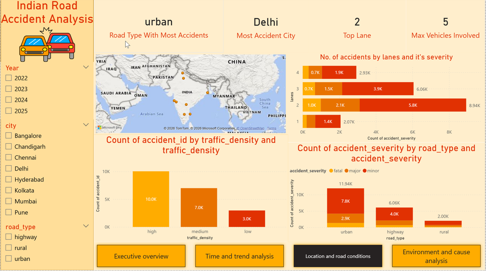
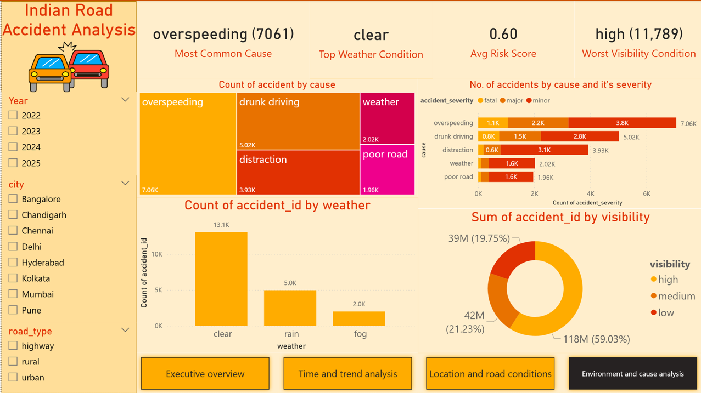

# Indian Road Accident Risk Prediction

Predicting accident risk severity from pre-accident conditions (time, weather, traffic, road type, and cause) using statistical testing and machine learning on a 20,000-row Indian road accident dataset.

## Project Overview

This project explores what actually drives accident risk on Indian roads, and builds a model to predict a `risk_score` (0–1) from situational inputs. The goal wasn't just to train a model that scores well — it was to verify which factors genuinely matter using independent statistical tests, then check that the model agrees.

**Dataset:** 20,000 accident records across 8 Indian cities, with 26 features covering location, time, weather, road conditions, cause, and severity.

## Key Finding

Across every method used — correlation, ANOVA, chi-square, and Random Forest feature importance — one result kept repeating:

`cause` and `weather` are the dominant drivers of risk_score. Time of day, lane count, and road type show negligible effect.

This consistency across independent statistical and machine learning methods is the central insight of the project — it's not just a model's opinion, multiple tools agree.

| Cause | Avg. Risk Score |
|---|---|
| Drunk driving | 0.69 |
| Overspeeding | 0.64 |
| Distraction | 0.52 |
| Weather-related | 0.47 |
| Poor road | 0.47 |

## Repository Structure

```
├── README.md
├── requirements.txt
├── comprehensive_risk_indian_roads_dataset.csv
├── accident_prediction.ipynb   # Model comparison, tuning, hypothesis tests
│── EDA.ipynb                  # Exploratory analysis & visualizations
├── visualization_roads_accident.pbix
└── images/
    └── (dashboard screenshots, key charts)
```

## Exploratory Data Analysis

10 visualizations covering severity distribution, accident causes, time-of-day patterns, weekend effects, and correlations between numeric features. Two standout findings:

- Accidents peak at night, with the count of minor, major, and fatal incidents all highest in the night period compared to morning, afternoon, or evening.
- The correlation heatmap confirms the numeric trip details barely matter — `hour`, `lanes`, `traffic_signal`, `vehicles_involved`, `casualties`, and `is_peak_hour` all correlate with `risk_score` at under 0.015 in magnitude.


## Statistical Testing

Three appropriate tests were used depending on variable type, rather than defaulting to one test for everything:

**Correlation** (numeric vs numeric)
| Comparison | r | p-value | Verdict |
|---|---|---|---|
| hour vs risk_score | 0.014 | 0.046 | Negligible (statistically significant only due to large sample size) |
| is_weekend vs risk_score | 0.147 | <0.001 | Weak but real effect |
| lanes vs risk_score | 0.004 | 0.578 | No effect |

**ANOVA** (category vs numeric)
| Comparison | F-statistic | p-value | Verdict |
|---|---|---|---|
| weather vs risk_score | 2505.98 | <0.001 | Strong effect |
| cause vs risk_score | 2072.90 | <0.001 | Strong effect |
| traffic_density vs risk_score | 1028.43 | <0.001 | Moderate effect |

**Chi-Square** (category vs category)
| Comparison | χ² | p-value | Verdict |
|---|---|---|---|
| cause vs accident_severity | 1372.03 | <0.001 | Significant association |
| traffic_density vs road_type | 2.70 | 0.609 | Independent |
| weather vs cause | 5.56 | 0.696 | Independent |

## Modeling

**Approach:** screen multiple model families with default settings first, then tune the most promising candidate — rather than tuning one model and declaring it the winner by default.

**Step 1 — Model screening (default hyperparameters):**

| Model | R² | RMSE | MAE |
|---|---|---|---|
| Linear Regression | 0.293 | 0.137 | 0.112 |
| Decision Tree | 0.772 | 0.078 | 0.062 |
| Random Forest | 0.778 | 0.077 | 0.061 |
| Gradient Boosting | 0.798 | 0.073 | 0.059 |

**Step 2 — Tuning:** Random Forest was selected for tuning via `GridSearchCV` (`n_estimators`, `max_depth`).

**Why Random Forest over Gradient Boosting:** Gradient Boosting scored marginally higher untuned, but the gap was small and Gradient Boosting hadn't been tuned yet. Random Forest was chosen because it's less sensitive to hyperparameters, more robust to overfitting (independent trees averaged, vs. Gradient Boosting's sequential error-correction), and faster to iterate on. 

**Final model performance:** R² = 0.790, RMSE = 0.075

**Feature importance:**
| Feature | Importance |
|---|---|
| cause | 0.358 |
| hour | 0.244 |
| weather | 0.242 |
| traffic_density | 0.125 |
| is_weekend | 0.032 |


## Dashboard

An interactive 4-page Power BI dashboard (`visualization_roads_accident.pbix`) covering:
- **Executive Overview** — KPIs, severity breakdown, accidents by city
- **Time & Trend Analysis** — day-of-week, monthly trend, hour-of-day patterns
- **Location & Road Conditions** — lanes, traffic density, road type vs severity
- **Environment & Cause Analysis** — cause breakdown, weather, visibility







## Tech Stack

`Python` · `pandas` · `scikit-learn` · `scipy` · `seaborn` / `matplotlib` · `Power BI`

## Setup

```bash
pip install -r requirements.txt
jupyter notebook
```

## Future Improvements

- Tune Gradient Boosting and Decision Tree to enable a fair best-vs-best comparison
- Explore festival-day effects on risk (currently excluded due to 99%+ missing data)
